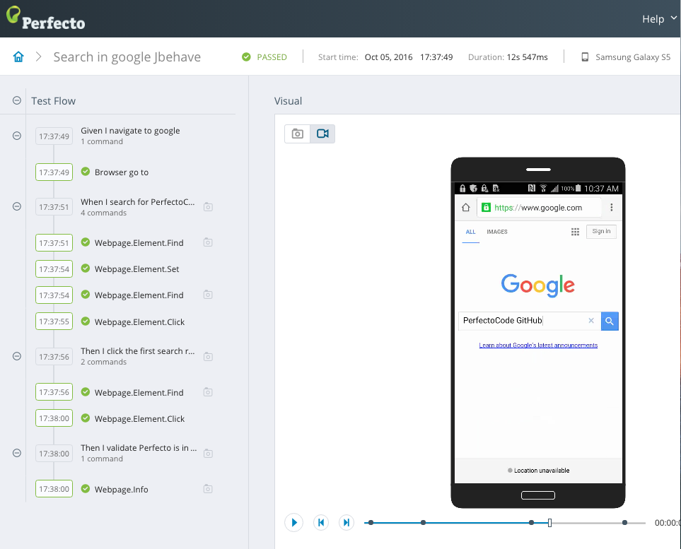
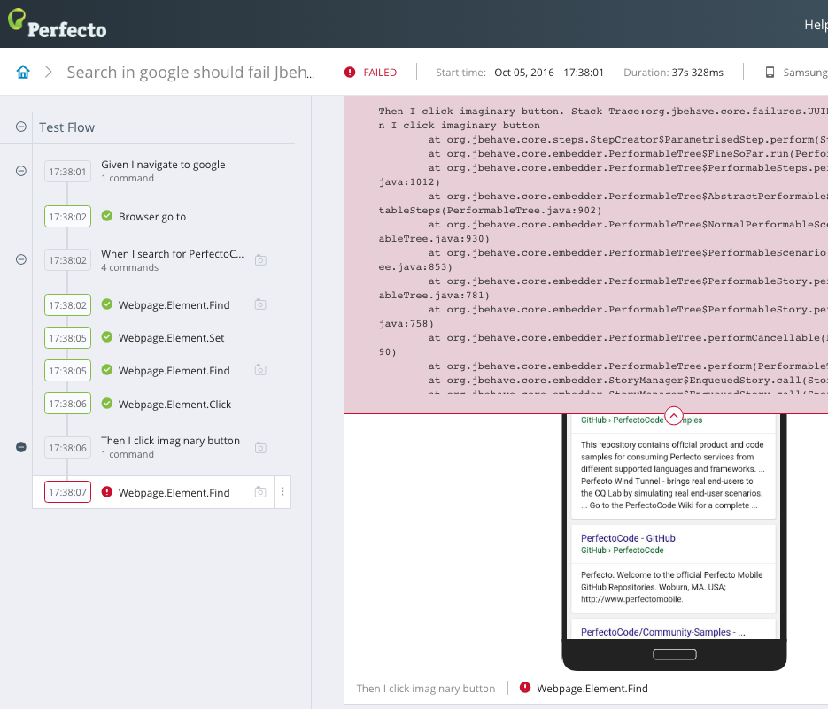
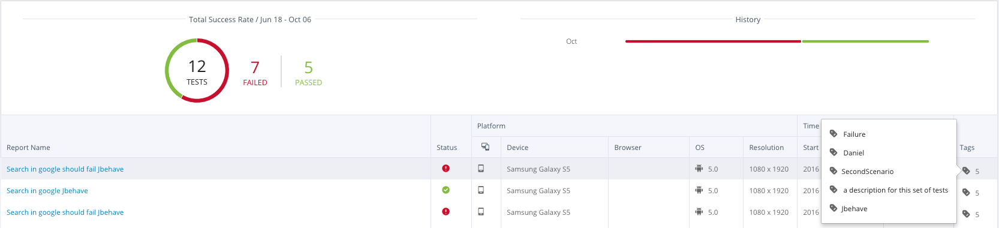

## JBehave 

This project demonstrates adding Reportium calls to Selenium tests that are run via [JBehave](http://jbehave.org/).

It includes a customized reporter [PerfectoReporter](src/test/java/Reporter/PerfectoReporter.java) which implements [Perfecto Reporting](https://github.com/PerfectoCode/Samples/wiki/Reporting) calls.<br/>

Jbehave Story contains multiple scenarios, each scenario is represented as a single test report in the Perfecto Reporting platform.
Each step (Given, When, Then) will be logged as a test step. 

In addition, this project includes two scenarios:<br/>
1. The first scenario shows a successful test execution within reporting UI.<br/>

2. The second scenario shows a failure test execution within reporting UI.

**Adding the additional reporter:**

Use your runner class (in this sample [runner](src/test/java/runner/runner.java)) and add the following lines to the configuration method:
```Java
@Override
public Configuration configuration() {
    return new MostUsefulConfiguration()
		.useStoryLoader(
			new LoadFromClasspath(this.getClass().getClassLoader()))
		.useStoryReporterBuilder(new StoryReporterBuilder()
			.withReporters(new PerfectoReporter(driverProvider) , ...... ) //It's possible to add additional reporters
		);
}
```

:information_source: driverProvider must be specified to use PerfectoReporter. <br/>

**Using the Driverprovider Class:**

The [DriverProvider](src/test/java/Objects/DriverProvider.java) instance holds the webdriver. <br/>
It later provides the WebDriver instance to the PerfectoReporter and steps implementation classes.<br/>
Set your Perfecto Lab user, password, host and DesiredCapabilities at the ***initialize*** method below.

:information_source: Initializing and closing the driver is done by PerfectoSteps which extends JBehave's Steps class.<br/>
That way before each story new instance of DriverProvider with a new WebDriver created and after each it taking care of closing the driver.

```Java
@Override
public void initialize() {
	DesiredCapabilities capabilities = new DesiredCapabilities();
	capabilities.setCapability("platformName", "Android");
	capabilities.setCapability("model", "");
	capabilities.setCapability("user", MyPerfectoUser);
	capabilities.setCapability("password", MyPerfectoPassword);

	//Other capabilities ... 

	try {
		driver = new RemoteWebDriver(new URL("http://" + MyHost + "/nexperience/perfectomobile/wd/hub"), capabilities);
	} catch (MalformedURLException e) {
		e.printStackTrace();
	}
}
```

**Adding ContextTags:**

ContextTags can be added to the test execution by adding `@PerfectoTags` to the Story or Scenario ***Meta*** data.<br/>
Story level tags will be added to all the tests executions within the same Story.<br/>
Scenario level tags will be added only to the particular test execution.<br/>

For example:
```Story
Meta:
@PerfectoTags Tag1, Tag2, a longer tag 			// This tags will be added to all tests executions

Scenario: Search in google Jbehave
Meta:
@PerfectoTags FirstScenario, Success 			// This tags will be added only to the particular test execution.
Given I navigate to google
When I search for PerfectoCode GitHub
Then I click the first search result
Then I validate Perfecto is in the page's title
```



**Running The Project:**<br/>
Run the [runner.java](src/test/java/runner/runner.java) file as Junit via IDE (Eclipse or Intellij).
